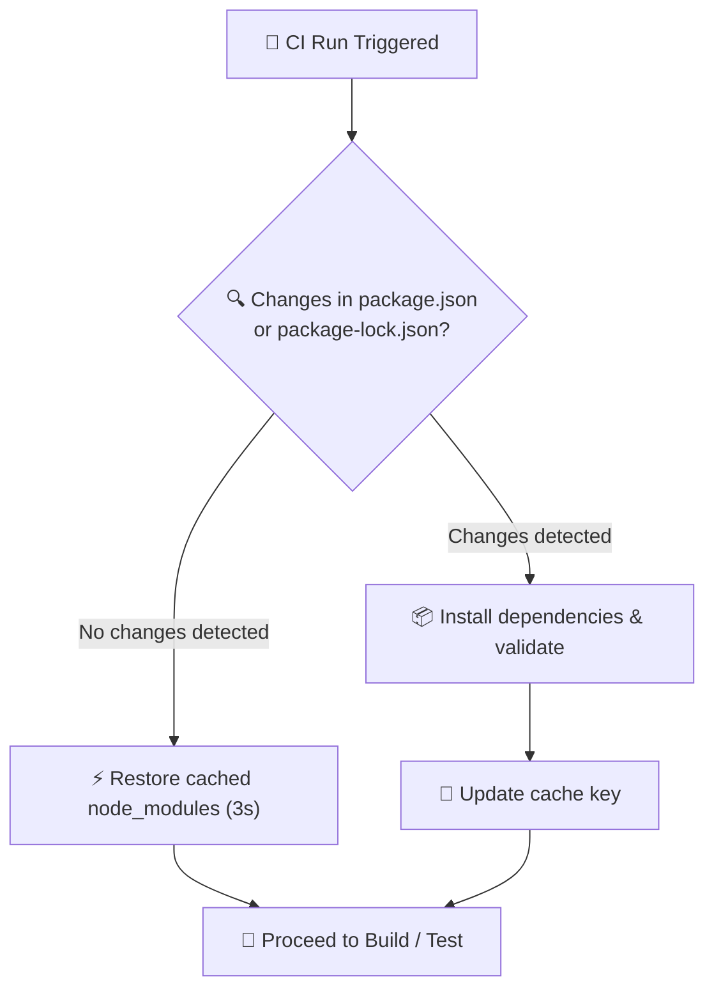

# Cache Node Modules and Install Dependencies

[](https://github.com/jgu7man/actions-node-cache-dependencies)
[](https://github.com/jgu7man/actions-node-cache-dependencies)
[](LICENSE)

A GitHub Action that efficiently manages Node.js dependencies by caching `node_modules` and installing dependencies only when necessary.

---

## 💡 Overview

Standard CI/CD workflows spend substantial runner time executing `npm install` or `npm ci` on every single run, even when dependencies haven't changed.

This action compares your current branch against the target branch (or inspects lockfile changes):
- **Cache Hit (No changes):** Restores cached `node_modules` directly from GitHub cache in seconds.
- **Cache Miss (Changes detected):** Performs a clean dependency installation, verifies integrity, and updates the cache.



---

## Features

- **Intelligent Change Detection:** Intelligently detects changes in `package.json` and `package-lock.json` against the target branch.
- **Cache Restoration:** Restores cached `node_modules` when possible.
- **Conditional Installation:** Installs dependencies only when necessary.
- **Private Package Registry Support:** Supports authentication for private GitHub packages.
- **Monorepo Ready:** Works with monorepos via configurable working directory.
- **Validation & Status Outputs:** Validates dependency installation and provides status outputs.
- **Graceful Error Handling:** Handles errors gracefully with helpful messages.

---

## Inputs

| Input | Description | Required | Default |
| :--- | :--- | :---: | :--- |
| `appVersion` | Version of the app for caching namespace | No | `1.0.0` |
| `registryToken` | GitHub token for authentication with private package registries | No | `""` |
| `targetBranch` | Target branch for comparison. If not provided, automatically detects repository default branch | No | `""` |
| `workingDir` | Directory containing `package.json` and where `node_modules` should be installed. Useful for monorepos | No | `.` |

## Outputs

| Output | Description |
| :--- | :--- |
| `success` | Whether dependencies were successfully prepared (`true` / `false`) |
| `source` | Source of dependencies: `"cache"`, `"install"`, or `"none"` |

---

## Usage

```yaml
steps:
  - uses: actions/checkout@v4
    with:
      fetch-depth: 0  # Required for comparing against target branch

  - name: Cache and install dependencies
    id: deps
    uses: jgu7man/actions-node-cache-dependencies@main
    with:
      appVersion: "1.2.3"                         # Optional: Version for cache key
      registryToken: ${{ secrets.GITHUB_TOKEN }}  # Optional: For private packages
      targetBranch: "main"                        # Optional: Branch to compare against
      workingDir: "./packages/app"                # Optional: For monorepos

  - name: Build
    if: steps.deps.outputs.success == 'true'
    run: npm run build
```

---

## Private Package Registry Authentication

If your project depends on packages from private registries (like GitHub Packages), provide a `registryToken` with appropriate read permissions:

```yaml
    - name: Cache and install dependencies
      uses: jgu7man/actions-node-cache-dependencies@main
      with:
        registryToken: ${{ secrets.GITHUB_TOKEN }}
```

---

## Monorepo Support

For monorepos or projects with non-standard directory structures, use the `workingDir` parameter:

```yaml
    - name: Cache and install dependencies
      uses: jgu7man/actions-node-cache-dependencies@main
      with:
        workingDir: "./packages/frontend"
```

---

## License

Distributed under the [MIT License](LICENSE). Created by [Jorge Guzmán (@jgu7man)](https://github.com/jgu7man).
